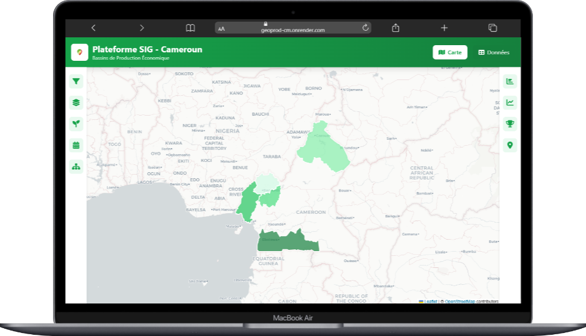
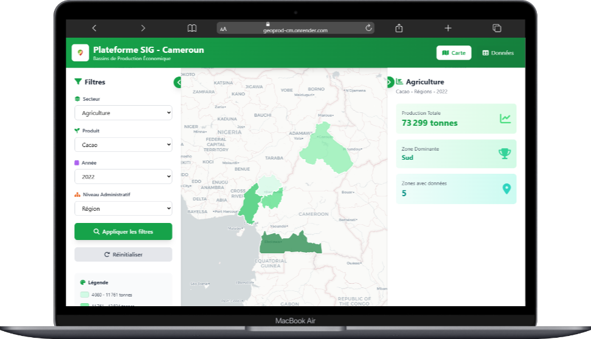
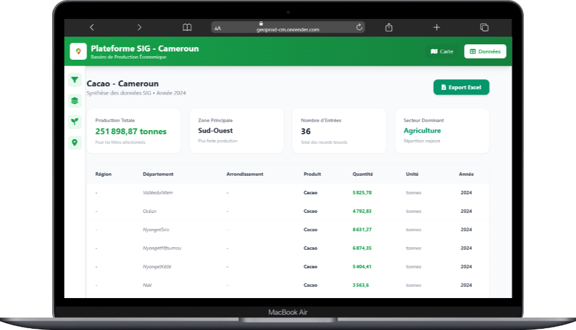

# 🌍 GeoProd_CM - Plateforme SIG des Bassins de Production

> **Déployé sur :** [https://geoprod-cm.onrender.com](https://geoprod-cm.onrender.com)

## 🎓 Contexte Académique
Ce projet a été réalisé comme projet de fin de 1er semestre en 5ème année pour le cycle d'ingénieur en Informatique, pour le compte du cours de **Traitement d'Images et SIG** à la **Ecole nationale supérieure polytechnique de Yaoundé (ENSPY)**.

**Enseignant en charge :** Dr Hyppolyte TAPAMO

---

## 📖 Introduction
**GeoProd_CM** est une plateforme web de Système d'Information Géographique (SIG) conçue pour visualiser et analyser les données de production économique (Agriculture, Élevage, Pêche) au Cameroun. Elle permet aux décideurs et au grand public de comprendre la répartition spatiale des ressources à travers les Régions, Départements et Arrondissements.

### 💡 Comprendre le SIG (Pour les novices)
Un **SIG (Système d'Information Géographique)** est un outil informatique qui permet de recueillir, stocker, traiter, analyser, gérer et présenter des données spatiales et géographiques.

**Dans ce projet, le SIG nous permet de :**
1. **Localiser** : Savoir *où* se trouve une production (ex: Dans quel département produit-on le plus de maïs ?).
2. **Visualiser** : Transformer des tableaux de chiffres illisibles en cartes colorées (cartes choroplèthes) compréhensibles en un coup d'œil.
3. **Analyser** : Croiser des données administratives (limites des régions) avec des données statistiques (tonnes de cacao).

C'est comme donner une "intelligence géographique" à un tableau Excel classique !

---

## 🚀 Fonctionnalités Clés

### 1. Cartographie Interactive
Visualisation spatiale des données avec une carte dynamique.
- **Choroplèthes** : Les zones se colorent selon l'intensité de la production (plus c'est foncé, plus la production est élevée).
- **Navigation Multi-échelle** : Zoom du niveau Régional -> Départemental -> Arrondissement.
- **Interactivité** : Clic sur une zone pour voir les détails précis.



### 2. Dashboard & Filtres Avancés
Une interface riche pour explorer les données sans la carte.
- **Filtres Dynamiques** : Sélection par Secteur, Produit, Année et Zone Administrative.
- **Tableaux de Données** : Visualisation sous forme de grille avec pagination.
- **Synthèses** : Résumés rapides des indicateurs clés.



### 3. Visualisation de Données (Data View)
Pour aller plus loin que la carte.
- **Analyses tabulaires** : Exploration fine des chiffres.
- **Export Données** : Possibilité d'exporter les résultats filtrés en Excel pour une réutilisation externe.



### 4. API Publique & Documentation
L'application expose une API REST publique permettant l'accès aux données brutes pour réutilisation. Nous avons sélectionné les endpoints les plus pertinents pour les développeurs tiers.
- **Documentation ReDoc** (Recommandé) : [Accéder à la documentation](/api/redoc/)
- **Swagger UI** (Test interactif) : [Accéder au Swagger](/api/docs/)

---

## 🛠️ Technologies et Outils Utilisés

Ce projet combine plusieurs technologies pour créer une architecture SIG robuste. Voici ce que nous avons utilisé et pourquoi :

### Backend (Le moteur)
- **Python & Django** : Le framework web principal. Choisi pour sa robustesse et sa capacité à gérer des logiques métier complexes rapidement.
- **Django REST Framework (DRF)** : Pour créer l'API qui envoie les données au frontend. C'est le "pont" entre notre base de données et l'interface utilisateur.
- **drf-spectacular** : Pour la génération automatique de la documentation d'API (Swagger/Redoc).
- **PostgreSQL & PostGIS** : 
  - *PostgreSQL* est notre base de données relationnelle.
  - *PostGIS* est l'extension magique qui transforme PostgreSQL en une base de données spatiale, capable de stocker et d'interroger des formes géométriques (polygones des régions, départements).

### Frontend (L'interface)
- **HTML5 / CSS3 / Vanilla JavaScript** : Pour une interface légère, rapide et maîtrisée sans la lourdeur des gros frameworks JS pour ce besoin spécifique.
- **Leaflet.js** : La bibliothèque cartographique leader en open-source. Elle nous permet d'afficher la carte, de gérer les zooms, les couleurs et les interactions utilisateurs simplement.
- **Tailwind CSS** : Pour un design moderne et responsive rapide à mettre en place.

### Déploiement
- **Render** : Plateforme cloud utilisée pour héberger l'application et la rendre accessible au monde entier.
- **Whitenoise** : Pour servir les fichiers statiques (images, CSS, JS) efficacement en production.

---

## 📈 Pistes d'Améliorations
Bien que fonctionnel, ce projet académique peut évoluer :
- **Séries Temporelles** : Visualiser l'évolution d'une production sur 10 ans avec une animation cartographique.
- **Données Météo** : Croiser la production avec la pluviométrie pour analyser l'impact du climat.
- **Mobile First** : Optimiser encore davantage l'interface cartographique pour les petits écrans de smartphones.

---

## 💻 Installation Locale

Si vous souhaitez tester le projet sur votre machine :

1. **Cloner le repo**
   ```bash
   git clone https://github.com/votre-username/geoprod-cm.git
   cd geoprod-cm
   ```

2. **Configurer l'environnement**
   Créez un fichier `.env` à la racine :
   ```env
   DEBUG=True
   SECRET_KEY=votre_cle_secrete
   DATABASE_URL=votre_url_postgis_locale
   ```

3. **Installer les dépendances**
   ```bash
   pip install -r requirements.txt
   ```

4. **Lancer le serveur**
   ```bash
   cd backend
   python manage.py runserver
   ```

---
© 2026 - **GeoProd_CM**
